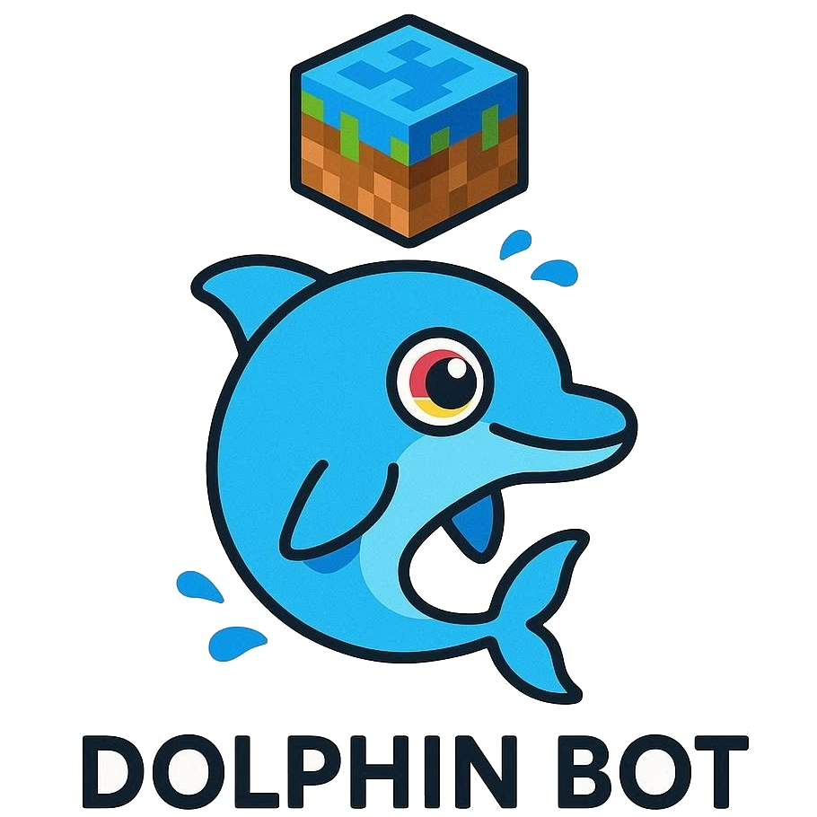
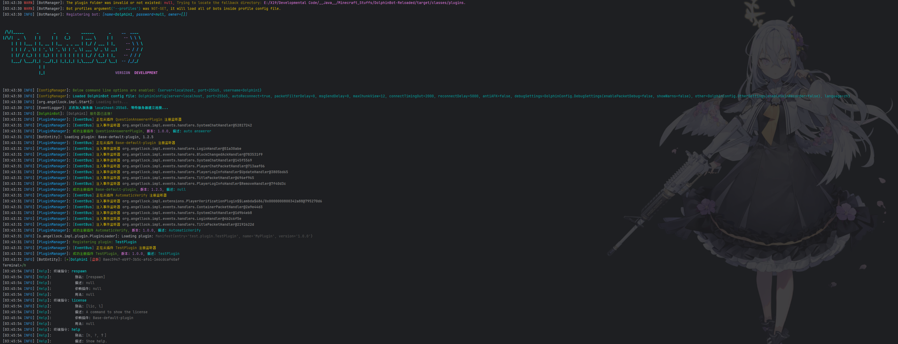
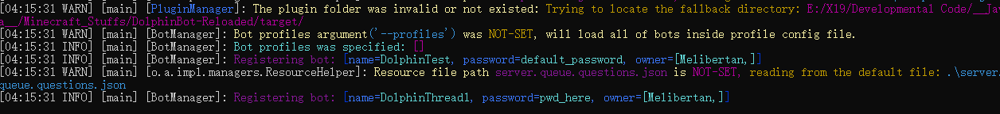

### Language: [简体中文](README_CN.md) / `English`
# DolphinBot

<p align="center">
   
   <br>
    <a href="https://www.oracle.com/java/technologies/downloads/">
        
    </a>
    <a href="">
        
    </a>
    <a href="">
        
    </a>
</p>
   <div align="center">
   ✨ A lightweight, high-scalable and cross-version MC bot for general minecraft server. It equipped bukkit-like plugin manager and easy-used APIs, allows you to customize event handles. ✨
   </div>
<p align="center">
  <a href="https://github.com/NeonAngelThreads/DolphinBot/releases">
    
  </a>
  <a href="https://github.com/NeonAngelThreads/DolphinBot/releases">
        
  </a>
   <br>
   <a href="https://github.com/NeonAngelThreads/DolphinBot/commits/master/">
      
   </a>
  
  <a href="https://github.com/NeonAngelThreads/DolphinBot/issues">
    
  </a>
  <a href="https://github.com/NeonAngelThreads/DolphinBot/tree/master/src/main">
     
  </a>
  <a href="https://app.codacy.com/gh/NeonAngelThreads/DolphinBot/dashboard?utm_source=gh&utm_medium=referral&utm_content=&utm_campaign=Badge_grade">
     
  </a>
  <p align="center">
     <a href="https://github.com/NeonAngelThreads/DolphinBot/blob/master/PluginDocs.md">📖Docs</a>
     ·
     <a href="https://github.com/NeonAngelThreads/DolphinBot/issues">🐛Submit Suggestion/Bug</a>
</p> 


## Why DolphinBot?
   - **Cross version**, with ViaVersion integrated, DolphinBot can support multi-version servers ranging from 1.7.x to 1.21.11 & 26.1.
   - **High reliability**, low network utilization, auto-reconnect when disconnected, long term running with no worries for losing connection.  
   - **High programmability**, DolphinBot implemented a **SpringBoot**-like finite **StateMachines**, allows you to easily configure **multiple login-process** for different servers.
   - **High extensibility**, DolphinBot embedded a mature DolphinAPI that contains variety of `packet listeners`, `event systems` and easy-used `event handlers` based on `mc protocol lib`,
     It integrates a bukkit-like plugin API, allowing you to develop custom plugins at very short time.  
   - **Advanced logging system**, DolphinAPI also implemented `TextComponent` serializer to parse rich colors and styles for server messages, with more useful debug information.
   - **High performance**, DolphinBot allows you to start multiple bot instances at single client with low CPU and Memory usage.
   - **Easy to use**, you can put the bot profile(s) into config file instead of defining on command-line, fast start.
### **Shortcuts**: [Custom plugin developing guideline](PluginDocs.md)
## Features:
   - Easy to register custom commands starting with `!` by using CommandBuilder DolphinAPIs.
   - Can **hot-inject** plugins during the connection of server.
   - Bypassing human verification in most servers including `2b2t.xin`.
   - Supporting to configure bot clusters, and start at once.

[//]: # (   - Supporting colourful console logging strings expression `colorizeText&#40;"&6Hello &lWorld"&#41;`.)
   - Automatic answer questions in `2b2t.xin` for speeding up login process.
   - Supporting to configure proxy settings for multiple bots.
   - **Web Console API** - Built-in HTTP API server for remote bot management and control.
   - **Real-time Log Streaming** - WebSocket-based log streaming with ANSI color support.
   - **Tab Completion** - Auto-completion support in web terminal, same as desktop experience.
   - **Multi-terminal Management** - Independent terminal instances for each bot with tab-based switching.

## Screenshots:
### Running on Windows server 2019:
<p align="center">
   
</p>

## Introduction:
   **Features category:**
-  [`Cross Version`](#cross-version-support)
- [`Hot-Reloading Plugin`](#hot-swapping-plugins-in-game)
- [`Terminal Interactions`](#interactions-in-terminal)
- [`Packet Debugger`](#config-file-setting)
- [`Proxy Settings`](#config-file-setting)
- [`DolphinBot Web Dashboard`](#web-console)

**Implemented Event APIs:**
- [`Programmable State Machine`](PluginDocs.md#3-programmable-login-state-machine)
- [`Command System`](PluginDocs.md#42-commands-system)
- [`Packet Handlers`](PluginDocs.md#4-deep-understand-dolphinapis)
- [`Event Handler System`](PluginDocs.md#3-register-event-handlers)
   - [`Player Events`](PluginDocs.md#player-events)
- [`Force Unicode Chat`](PluginDocs.md#unicode-string-helper)

## Cross Version Support

| Supported Versions | Protocol ID Range | Support Stat |
|--------------------|-------------------|--------------|
| 26.1.x             | 775-777           | ✓            |
| 1.21.x             | 767-774           | ✓ Base       |
| 1.20.x             | 761-766           | ✓            |
| 1.19.x             | 759-760           | ✓            |
| 1.18.x             | 757-758           | ✓            |
| 1.17.x             | 755-756           | ✓            |
| 1.16.x             | 735-754           | ✓            |
| 1.15.x             | 573-578           | ✓            |
| 1.14.x             | 477-498           | ✓            |
| 1.13.x             | 393-404           | ✓            |
| 1.12.x             | 335-340           | ✓            |
| 1.11.x             | 315-316           | ✓            |
| 1.10.1             | 210               | ✓            |
| 1.9.x              | 107-110           | ✓            |
| 1.8.x              | 47                | ✓            |
| 1.7.x              | 4-5               | ✓            |
## Interactions in Terminal
- You can send in-game messages or execute commands form the dolphin bot terminal.
- Built-in commands:
- 
  |         Terminal Commands         | Description                                       |
  |:---------------------------------:|---------------------------------------------------|
  | `reload <plugin Name> [bot name]` | Hot-reloading a specified plugin                  |
  |  `load <pLugin Name> [bot name]`  | Hot-loading a specified plugin                    |
  |        `reconnect` (`rc`)         | Reconnect to the server in game.                  |
  |     `license`    (`l`, `lic`)     | Show the license on the terminal                  |
  |        `help`   (`h`, `?`)        | Show the Command menu and usages for each command |
  |         `respawn` (`rs`)          | Respawn the bot.                                  |
   
- For these commands, you can press `TAB` to complete automatically.
## Getting Started
In this section, you will understand below how-tos:  
  - **1. How to directly start a single bot with command-line.**  
  - **2. How to specify bot profile with config file without command-line.**  
  - **3. How to start multiple bot simultaneously with proxy settings**  
  - **4. How to configure advanced options**  
  - **5. How to make a custom plugin**  
  - **6. How to use Web Console for remote management**  

1. **Download the Client**  
   Download the jar archive file: `DolphinBot-[version]-full.jar`.  

> [!IMPORTANT]
> Requirements: **Java version >= 17**

2. **Configuration of the Bot**  
### Configuring Profile 
   There are two different ways to set bot config:
   - If you want to quickly start for simplicity, you can use **Command-line setting**  
   - If you would like to start multiple bot at once, and access advanced options, you can use **Config file setting**    

1. **Command-line Setting**  
     In-game profile should be defined on below boot command-line.  
     An example of argument list:
     ```bash
     java -jar "DolphinBot-[version]-full.jar" --username=[username] --password=[password] --skin-recorder=[enable/disable]
     ```
   | Command Lines      | Description                                                                |
   |--------------------|----------------------------------------------------------------------------|
   | `--username`       | in-game displaying name of bot.                                            |
   | `--password`       | password for login or register.                                            |
   | `--auto-reconnect` | whether reconnect to server when got kicked or disconnect by some reasons. |
    | `--skin-recorder`  | whether automatic capture and save online players' skins.                  |
   | `--server`         | target server address.                                                     |
   | `--port`           | target server port.                                                        |

   Example:
     ```bash
     java -jar "DolphinBot-[version]-full.jar" --username=[username] --password=[password] --server=0.0.0.0 --port=25565
     ```
     ```bash
     java -jar "DolphinBot-[version]-full.jar" --username=Dolphin1 --password=123 --server=2b2t.xin --port=25565 --owner=Melibertan
     ```
   <p align="center">
     
   </p>
         
> [!NOTE]
> Command-line has high authority than config file, meaning that if options are duplicated, will only recognize 
   command-line, and ignore config file one.  
   
> [!TIP]
> Optionally, you can specify more option by adding argument:  
   `--owner` : Specifying only who can use this bot.  
   
  **Example:**   
   `--owner=Melibertan`, of course, you also can define multiple names. For each owner name, should be split with ";".  
   **Example:**  
   `--owner=owner1;owner2;owner3;...`  

   ### Config File Setting    
   Config files include functional config `bot.config.global.json` and profile config `bot.profiles.json`  
      You can also move above profile arguments into config file ``bot.profiles.json`` following below formats, all config values in it will be loaded.
      DolphinBot will apply command-line options first, duplicated options in config file will be ignored.    
      To specify the path of config file is optional, Use option `--config-file` to locate config directory or file.  
      For example:  
   ```bash 
   java -jar "DolphinBot-[version].jar" --config-file=path/to/config.json
   ```
   If the path you specified is a directory instead of a file, Dolphin will extract config file as default config in this directory.  
   ```bash
   java -jar "DolphinBot-[version].jar" --config-file=path/to/config_directory
   ```
   If the `--config-file` parameter is absented, DolphinBot will create a default file on jar directory.  
   ```bash 
   java -jar "DolphinBot-[version].jar"
   ```
   **multiple bot & proxy settings**  
      In the profile config file, you can create `profiles` field in `bot.profiles.json` to specify multiple bot profiles to log to a server.  
               
> [!NOTE]
> Some servers may prohibit multiple bots started on same IP, the proxy settings is aimed to help you to run multiple bots
> from different network environments or requiring distinct egress IPs.  
     
To configure proxy settings for each bot, you need to edit `proxy` field. An example shown below:
        
> [!WARNING]
> Defining multiple bots may trigger the anti-bot or anti-cheat, and some servers with strict policy may prohibit it.
    
```json
{
   "profiles": {
      "bot#1": {
         "name": "Player494",
         "password": "123example",
         "owner": ["player_name"],
         "enabled_plugins": [
            "QuestionAnswerer",
            "MessageDisplay",
            "HumanVerify"
         ],
         "proxy": {
            "enabled": false,
            "info": {
               "address": "XX.XXX.XXX.XX",
               "port": 8081,
               "type": "SOCKS4",
               "username": "",
               "password": ""
            }
         }
      },
      "bot#2": {
         "name": "Player495",  
         "password": "password",
         "owner": ["player_name", "other_owner"],
         "enabled_plugins": [
            "HumanVerify"
         ],
         "proxy": {
            "enabled": false,
            "info": {"...": "..."}
         }
      },
      "bot#3": {"...": "..."}
   }
}
```
          
   1. `enabled_plugins` field represents which plugins should enable on the bot.   
   2. `proxy` fields (optional) represents a proxy configurations for each bot, field `enabled` marks whether activate this proxy setting,   
               and field `info` contains:
      
      | field       | Description                                     |
      |-------------|-------------------------------------------------|
      | `address`   | Remote IP address or host name of proxy server. |
      | `port`      | Proxy server port.                              |
      | `type`      | Proxy mode. (`HTTP`, `SOCKS4`, `SOCKS5`)        |

> [!TIP]
> "username", "password" is optional, if the remote proxy server require to auth, then you need to add these.

   In this case, if you want to load `bot#1` as your single bot, you should add below argument:  
   ```bash
   java -jar "DolphinBot-[version].jar" --config-file=path/to/config_directory --profiles="bot#1"
   ```
   ```bash
   java -jar "DolphinBot-[version].jar" --profiles="bot#1"
   ```   
   If you want to start multiple bot simultaneously, specify multiple profile name as a list in option `--profiles`, for
each profile name, should be split with ";".

   **Examples:**
   ```bash
   java -jar "DolphinBot-[version].jar" --profiles="bot#1;bot#2;bot#3;..."
   ```

> [!NOTE]
> If the `--profiles` option is absented, it will load all bots in profile config by default.  

**Owners:**  
   If you want to limit a bot can be only use by specified player(s) you can put player names into `owner` as list.  
   **Example:**
```json
{
   "profiles": {
      "bot#1": {
         "name": "Player494",
         "password": "123example",
         "owner": [
            "owner1", 
            "owner2",
            "owner3"
         ],
         "enabled_plugins": [ "QuestionAnswerer", "MessageDisplay", "HumanVerify" ],
         "proxy": {
            "enabled": false,
            "info": {
               "address": "XX.XXX.XXX.XX",
               "port": 8081, 
               "type": "SOCKS4",
               "username": "",
               "password": ""
            }
         }
      }
   }
}
```
### Advanced Configurations (optional)
   If you want to access more advanced configs, you can edit `bot.config.global.json`.  
   Every single config option is equilibrium to option that defined by command line, and all config value including
   unrecognized option will be parsed, so you can add your customize config options.  
   An example for configuring this file:
```json
{
  "server": "2b2t.xin",
  "port": 25565,
  "auto-reconnect": true,
  "packet-filter-delay": 0,
  "msg-send-delay": 0,
  "max-chunk-view": 12,
  "anti-AFK": true,
  "language": "zh",
  "connect-timing-out": 2000,
  "reconnect-delay": 5000,
  "debug-settings": {
    "enable-packet-debug": false,
    "packet-warning": true
  },
  "other": {
    "enable-skin-recorder": false
  }
}
```   
   ### Config Options:
   
   | Config                 | Description                                                                |
   |------------------------|----------------------------------------------------------------------------|
   | `server`               | For defining server address.                                               |
   | `port`                 | For defining server port.                                                  |
   | `auto-reconnecting`    | Whether reconnect to server when got kicked or disconnect by some reasons. |
   | `enable-skin-recorder` | Whether enable skin recorder.                                              |
   | `packet-filter-delay`  | Max receiving delay(millis) between every target packet.                   |
   | `max-chunk-view`       | Max scale of chunk packet receiving.                                       |
   | `connect-timing-out`   | How long millis does it take to determine a connection time out.           |
   | `reconnect-delay`      | Min delay(millis) for cooling down when reconnect a server.                |
   | `msg-send-delay`       | The delay of sending in-game messages.                                     |
   | `enable-packet-debug`  | Whether enable packet debugger.                                            |
   | `packet-warning`       | Showing packet errors or not.                                              |
   | `language`             | The UI locale settings. (Supports `zh`, `en` languages currently)          |
   | `anti-AFK`             | Whether bypassing AFK（Away From Keyboard) detection.                       |

## Hot Swapping Plugins In-Game
Dolphin bot supports you to **hot-reload** and **hot-load** (**hot injection**) plugins in server, without quit the entire client and reconnecting to server.
You can send `!reload <pluginName>` dolphin command in server chat.  
Alternatively, you can type `reload plugin.jar` in the terminal to hot-reload plugins.

## Web Console
DolphinBot now includes a built-in Web Console for remote bot management and control. This allows you to manage your bots through a modern web interface without needing direct terminal access.

### Starting the Web Console
To enable the Web Console, simply add the `--api` parameter when starting DolphinBot:

```bash
java -jar "DolphinBot-[version]-full.jar" --api [port]
```

The API server will start on the specified port (default: 25560), and the WebSocket log server will start on port+1 (default: 25561).

### Web Console Features
- **Bot Management Dashboard** - View all bot instances with real-time status, game mode, and position
- **Independent Terminals** - Each bot has its own terminal instance with tab-based switching
- **Real-time Log Streaming** - All logs are streamed to the web terminal with full ANSI color support
- **Tab Completion** - Auto-completion works exactly like the desktop terminal
- **Modern UI/UX** - Beautiful modal dialogs, toast notifications, and responsive design
- **Bot Statistics** - Visual circular progress showing online rate with color-coded status

### Accessing the Web Console
Once the API server is running, you can access the Web Console at:
```
http://localhost:8080
```

The Web Console is provided as a separate Spring Boot application located in the `web-console/` directory. See [Web Console Documentation](web-console/README.md) for detailed setup and usage instructions.

### API Endpoints
The built-in HTTP API provides the following endpoints:

| Endpoint | Method | Description              |
|-----------|----------|--------------------------|
| `/api/health` | GET | Health check             |
| `/api/bots` | GET | List all bots            |
| `/api/bots/start` | POST | Start a bot              |
| `/api/bots/stop` | POST | Stop a bot               |
| `/api/bots/send-command` | POST | Send command to a bot    |
| `/api/config` | GET/POST | Get/Update configuration |
| `/api/bot/create`      |   POST       | create new bot           |             
| `/api/bot/delete`      |     POST         | delete specified bot     |      

### WebSocket Endpoints
| Endpoint | Description |
|-----------|-------------|
| `ws://localhost:25561` | Log streaming and tab completion |

## FAQ

- Can I make my plugin for dolphin bot?   
    Yes, DolphinBot has an easy used plugin system, aggregating bukkit-like API, here is the [Full guideline for development.](PluginDocs.md)


- Is it difficult to configure the config files?  
    No, the initial config is highly sufficient to use for most cases.


- How do I put issues or request features?  
    Open an issue bar on GitHub Issues. Detailed steps or reproduce are appreciated.


- Can I join the DolphinBot development?  
    Sure! you can become the **second contributor** of DolphinBot team! you can join at any time freely. 

### Our First Contributor:
1. huangdihd - (Fixed a critical bug in commit(`#372990a`)
## Community
  - Encountered a bug? issues and suggestions are welcome!  
  My Bilibili space:
  https://m.bilibili.com/space/386644641  
  - If you like DolphinBot, a **star** helps a lot!

## License
GPL-3.0 or later, see the [full LICENSE](LICENSE).

### **By NeonAngelThreads, coding with ❤️**
