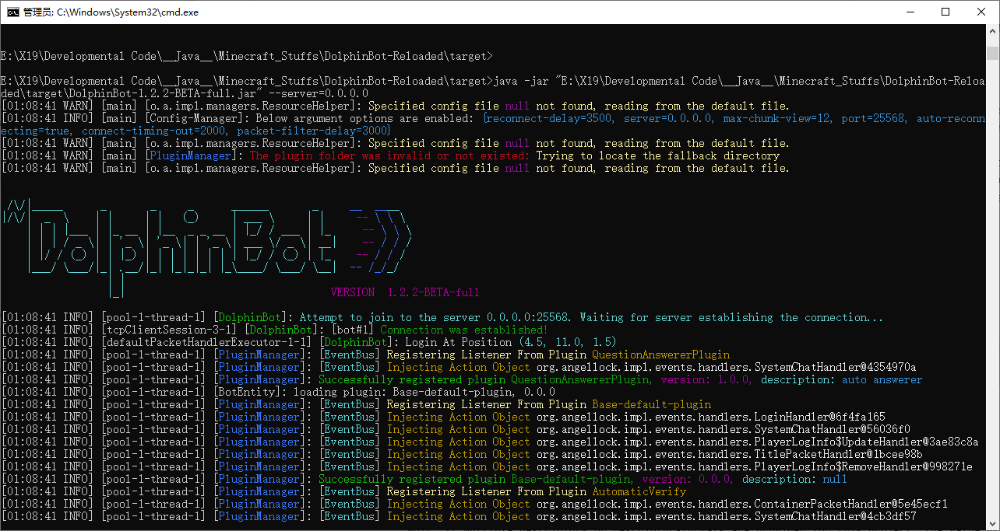

## 语言： `简体中文` / [English](README.md)
# DolphinBot - 重装上阵

<p align="center">
   
   <br>
    <a href="https://www.oracle.com/java/technologies/downloads/">
        
    </a>
</p>

   <div align="center">
   ✨ 一款轻量级、可靠、智能的MC机器人，适用于广泛Minecraft服务器，具有高可扩展性和高性能。它集成了Bukkit等插件加载器和易于使用的Bukkit风格API，允许您自定义事件处理。 ✨
   </div>
<p align="center">
  <a href="https://github.com/NeonAngelThreads/DolphinBot/releases">
    
  </a>
   <br>
   <a href="https://github.com/NeonAngelThreads/DolphinBot/commits/master/">
      
   </a>
  
  <a href="https://github.com/NeonAngelThreads/DolphinBot/issues">
    
  </a>
  <a href="https://github.com/NeonAngelThreads/DolphinBot/tree/master/src/main">
     
  </a>
  <p align="center">
     <a href="https://github.com/NeonAngelThreads/DolphinBot/blob/master/PluginDocs.md">📖开发文档</a>
     ·
     <a href="https://github.com/NeonAngelThreads/DolphinBot/issues">🐛提交建议/错误报告</a>
  </p>
</p>

## 为什么选择 DolphinBot？
   - **高可靠性**, 网络利用率低，断开连接后自动重连，长时间运行无需担心连接丢失。  
   - **高可编程性**, DolphinBot 实现了类似 **SpringBoot** 的 **状态机**，让您可以轻松地为不同的服务器配置 **自定义登录流程**。
   - **高可扩展性**, DolphinBot 嵌入了成熟的 DolphinAPI，其中包含基于 mc 协议库的各种“数据包监听器”、“事件系统”和易于使用的“事件处理程序”，它集成了类似 Bukkit 的插件 API，使您可以在很短的时间内开发自定义插件。
     
   - **高级日志系统**，DolphinAPI 还实现了 `TextComponent` 序列化器，用于解析服务器消息的丰富颜色和样式，并提供更多有用的调试信息。
   - **高性能**，DolphinBot允许您在单个Java客户端上启动多个机器人实例，同时保持超低的 CPU 和内存占用率。
   - **易于使用**，直接运行，您可以将机器人配置文件放入配置文件中，而不是在命令行中定义，快速启动。
### **快捷方式**: [自定义插件开发指南](PluginDocs.md)
## 功能特性:
   - 使用 CommandBuilder 的 DolphinAPI，可以轻松注册以 `!` 开头的自定义命令。
   - 加入服务器后可以直接/load**热注入**插件，和/reload热重载插件。
   - 友好的终端体验，支持丰富颜色和样式。
   - 支持配置机器人集群，并立即启动。
   - 支持彩色控制台日志字符串表达式 `colorizeText("&6Hello &lWorld")`。
   - `2b2t.xin` 中自动回答问题，以加快登录过程。
   - 支持在客户端于服务器运行时重新加载插件。

## 截图:
### Running on Windows server 2019:
<p align="center">
   
</p>

## 介绍:
   **特色类别:**  
   - [`热重载插件`](#hot-swapping-plugins-in-game)
- [`终端交互`]()

**已实现事件 API:**
- [`可编程状态机`](PluginDocs.md#3-programmable-login-state-machine)
- [`命令系统`](PluginDocs.md#42-commands-system)
- [`数据包处理程器`](PluginDocs.md#4-deep-understand-dolphinapis)
- [`事件处理系统`](PluginDocs.md#3-register-event-handlers)
   - [`玩家事件API`](PluginDocs.md#player-events)
- [`强制 Unicode 聊天`](PluginDocs.md#unicode-string-helper)

## Interactions in Terminal
- 您可以通过DolphinBot终端发送游戏消息，或执行命令。
- 内置命令:
- 
  | Terminal Commands                            | Description   |
  |----------------------------------------------|---------------|
  | `reload <插件名称> <机器人名称（可选）>` | 热重载指定的插件      |
  | `load <插件名称> <机器人名称（可选）>`   | 热加载（热注入）指定的插件 |
   
- 对于这些命令，您可以按`TAB`键自动补全。
## 快速入门
在本节中，您将了解以下操作方法：    
  - **1. 如何直接使用命令行启动单个机器人。**  
  - **2. 如何在不使用命令行的情况下通过配置文件指定机器人配置文件？**  
  - **3. 如何同时启动多个机器人**  
  - **4. 如何配置高级选项**  
  - **5. 如何制作自定义插件**  

1. **下载客户端**  
   下载 jar 归档文件: `DolphinBot-[version]-full.jar`.  
   系统要求：**Java 版本 >= 17**
2. **机器人配置**  
**配置配置文件**  
   设置机器人配置有两种不同的方法：
   - 如果您为了简单快速地启动并且只启动一个机器人，可以使用**命令行设置**。   
   - 如果您想同时启动多个机器人并访问高级选项，可以使用**配置文件设置**。    

   1. **命令行设置**  
        游戏内配置文件应在以下启动命令行中定义。  
        参数列表示例：
        ```bash
        java -jar "DolphinBot-[version]-full.jar" -username=[username] -password=[password] -skin-recorder=[enable/disable]
        ```
      `--username` : 游戏内显示机器人名称。   
      `--password` : 登录或注册密码。  
      `--auto-reconnect` : 被踢出服务器或因某些原因断开连接后是否重新连接。  
      `--skin-recorder` : 是否自动捕获并保存在线玩家的皮肤。  
      `--server` : 目标服务器地址。  
      `--port` : 目标服务器端口。  
      Example:
        ```bash
        java -jar "DolphinBot-[version]-full.jar" --username=[username] --password=[password] --server=0.0.0.0 --port=25565
        ```
      or
        ```bash
        java -jar "DolphinBot-[version]-full.jar" --username=Dolphin1 --password=123 --server=2b2t.xin --port=25565 --owner=Melibertan
        ```
      命令配置文件将被加载：
      <p align="center">
        
      </p>

      **警告：** 命令行参数的权限高于配置文件，这意味着如果选项重复，则只会识别命令行参数，且忽略配置文件中的选项。  
      您还可以通过添加参数来指定更多选项：  
      `--owner` : 仅指定哪些人可以使用此机器人。  
   2. **Config File Setting**  
         配置文件包括功能配置文件 `mc.bot.config.json` 和账户配置文件 `bot.profiles.json`  
         您还可以按照以下格式将上述配置文件参数移至配置文件`bot.profiles.json`中，其中的所有配置值都将被加载。  
         DolphinBot 将首先应用命令行选项，配置文件中重复的选项将被忽略。  
         指定配置文件路径是可选的，使用选项 `--config-file` 来定位配置目录或文件。  
         例如:  
         ```bash 
         java -jar "DolphinBot-[version].jar" -config-file=path/to/config.json
         ```
         如果您指定的路径是目录而不是文件，DolphinBot 会将配置文件提取到该目录中作为默认配置。
         ```bash
         java -jar "DolphinBot-[version].jar" -config-file=path/to/config_directory
         ```
         如果缺少 `--config-file` 参数，DolphinBot 将在 jar 目录中创建一个默认文件。  
         ```bash 
         java -jar "DolphinBot-[version].jar"
         ```
         
         在配置文件中，您可以在 `bot.profiles.json` 中创建 `profiles` 键，以指定要记录到服务器的多个机器人配置文件。    
         **警告**：定义多个机器人可能会触发反机器人或反作弊机制，一些策略严格的服务器可能会禁止这种行为。  
         ```json
         {
            "profiles": {
               "bot#1": {
                  "name": "Player494",
                  "password": "123example",
                  "owner": ["player_name"],
         
                  "enabled_plugins": [
                     "QuestionAnswerer",
                     "MessageDisplay",
                     "HumanVerify"
                  ]
               },
               "bot#2": {
                  "name": "Player495",  
                  "password": "password",
                  "owner": ["player_name", "other_owner"],
         
                  "enabled_plugins": [
                     "HumanVerify"
                  ]
               },
               "bot#3": {"...": "..."}
            }
         }
         ```
         其中 `enabled_plugins` 键表示应该在机器人上启用哪些插件。  
         在这种情况下，如果您想将 `bot#1` 作为唯一的机器人加载，则应添加以下参数：  
         ```bash
         java -jar "DolphinBot-[version].jar" --config-file=path/to/config_directory -profiles="bot#1"
         ```  
         or
         ```bash
         java -jar "DolphinBot-[version].jar" --profiles="bot#1"
         ```   
         如果要同时启动多个机器人，请在 `-profiles` 选项中指定多个配置文件名称列表，

         每个配置文件名称之间应以“;”分隔。

         **Examples:**  
         ```bash
         java -jar "DolphinBot-[version].jar" --profiles="bot#1;bot#2"
         ```  
         ```bash
         java -jar "DolphinBot-[version].jar" --profiles="bot#1;bot#2;bot#3;..."
         ```
       - **警告**: 如果没有 `--profiles` 选项，则默认情况下会加载配置文件中的所有机器人。

      **Owners:**  
        如果你想限制某个机器人只能由指定的玩家使用，你可以将玩家姓名作为列表添加到 `owner` 中。  
      **Example:**
         ```json
         {
            "profiles": {
               "bot#1": {
                  "name": "Player494",
                  "password": "123example",
                  "owner": [
                     "owner1", 
                     "owner2",
                     "owner3"
                  ],

                  "enabled_plugins": [
                     "QuestionAnswerer",
                     "MessageDisplay",
                     "HumanVerify"
                  ]
               }
            }
         }
        ```

      或者您也可以直接通过命令行进行定义。
      **Example:**
      `--owner=Melibertan`, 当然，您也可以定义多个名称。:  
      每个owner名字应以“;”分隔。.  
      **Example:**
      `--owner=owner1;owner2;owner3;...`
   2. **高级配置（可选）**  
      如果你想访问更高级的配置，可以编辑`mc.bot.config.json`。  
      每个配置选项都与命令行定义的选项相对应，所有配置值（包括无法识别的选项）都将被解析，因此您可以添加自定义配置选项。  
      配置此文件的示例:
      ```json
       {
          "server": "2b2t.xin",
          "port": 25565,
          "auto-reconnecting": true,
          "enable-skin-recorder": true,
   
          "packet-filter-delay": 3000,
          "msg-send-delay": 3000,
          "max-chunk-view": 12,
   
          "connect-timing-out": 2000,
          "reconnect-delay": 3000,
          "enable-packet-debug": false
      }
      ```   
      Config Options:
   
      | Config                 | Description              |
      |------------------------|--------------------------|
      | `server`               | 用于定义服务器地址。               |
      | `port`                 | 用于定义服务器端口。               |
      | `auto-reconnecting`    | 被踢出服务器或因某些原因断开连接后是否重新连接。 |
      | `enable-skin-recorder` | 是否启用皮肤记录器。               |
      | `packet-filter-delay`  | 每个目标数据包之间的最大接收延迟（毫秒）。    |
      | `max-chunk-view`       | 最大区块数据包接收规模。             |
      | `connect-timing-out`   | 确定连接超时需要多少毫秒？            |
      | `reconnect-delay`      | 服务器重新连接时冷却所需的最小延迟（毫秒）。   |
      | `msg-send-delay`       | 游戏内消息发送延迟。               |
      | `enable-packet-debug`  | 是否启用数据包调试器。              |
## Hot Swapping Plugins In-Game
Dolphin bot supports you to **hot-reload** and **hot-load** (**hot injection**) plugins in server, without quit the entire client and reconnecting to server.
You can send `!reload <pluginName>` dolphin command in server chat.  
Alternatively, you can type `reload plugin.jar` in the terminal to hot-reload plugins.

## FAQ

- 我可以为 DolphinBot 制作插件吗？   
    是的，DolphinBot 有一个易于使用的插件系统，聚合了类似 Bukkit 的 API，以下是[完整的开发指南](PluginDocs.md)


- 配置配置文件难吗？  
    不，初始配置足以满足大多数情况的需求。


- 我该如何提交问题（Issue）或提出功能请求？  
    请在 GitHub Issues 栏中提交问题。请根据模板提供详细步骤或复现步骤。


- 我可以参与DolphinBot的开发吗？  
    当然可以！您可以成为 DolphinBot 团队的**第二位贡献者**！您可以随时自由加入。   

### 我们的第一位:
1. huangdihd - (修复了提交(`#372990a`)中的一个严重错误。我们期待第二位发现bug的贡献者！
## 社区
  - 遇到bug了吗？欢迎提出问题和建议！    
    我的Bilibili空间：
  https://m.bilibili.com/space/386644641
  -   
    **如果你喜欢 DolphinBot，欢迎点一颗小小的 Star！** 

## 开源协议
GPL-3.0 或更高版本，请参阅[完整开源许可](LICENSE).

### **By NeonAngelThreads, coding with ❤️**
